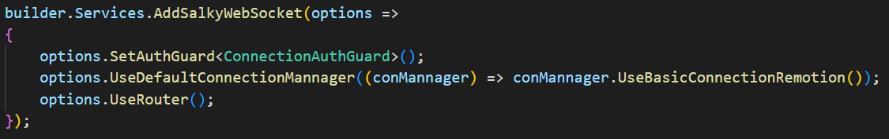
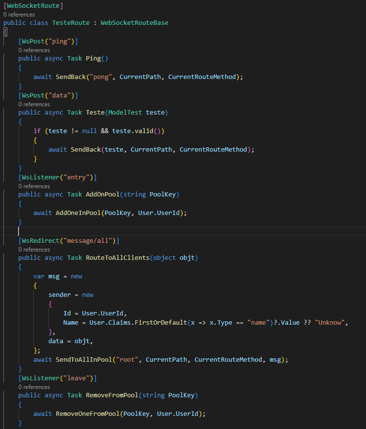

# Salky.WebSockets
> Salky abstrai o uso de WebSocket para uma aplicação similar a implementação de http do dotnet

### Como usar

- Criar uma aplicação web
- Executar o codigo abaixo / injectar no container de dependências

    - `SetAuthGuard` é usado para permitir ou não a entrada de um usuario
    - `UseDefaultConnectionMannager` irá armazenar e disponibilizar as conexões abertas quando preciso
        - `UseBasicConnectionRemotion` irá remover e adicionar as novas conexões automaticamente
    - `UseRouter` ira mapear as rotas de WebSocket

 

- Criar a sua rota, que será uma classe que herda de `WebSocketRouteBase` e é anotada por `WebSocketRoute`. Por convenção o caminho da rota no caso abaixo será `'teste'`, sendo possível passar por parâmetro o nome da rota.
 
   
    - Cada metodo que está anotado será uma rota aninhada dentro da rota da classe

    - Cada rota final, possui um metodo e um caminho

    - O anotador do metodo representa o `metodo` da rota e o `caminho`

    - Cada rota recebe um único parâmetro, de qualquer tipo.   Para multiplos parâmetros é recomendado encapsular em uma classe ou record
    
    - `WebSocketRouteBase` fornece metodos para manipular os clientes, recuperar claims/id do client via `User` como demontrado abaixo

 

> ### [Como usar no lado do cliente `(JS)`](https://github.com/GuilhermePSDG/Salky.WebSockets/blob/main/Example/JavaScriptUseCase/index.js)

 

<h4 align="center"> 🚧 Projeto em construção 🚧 </h4>